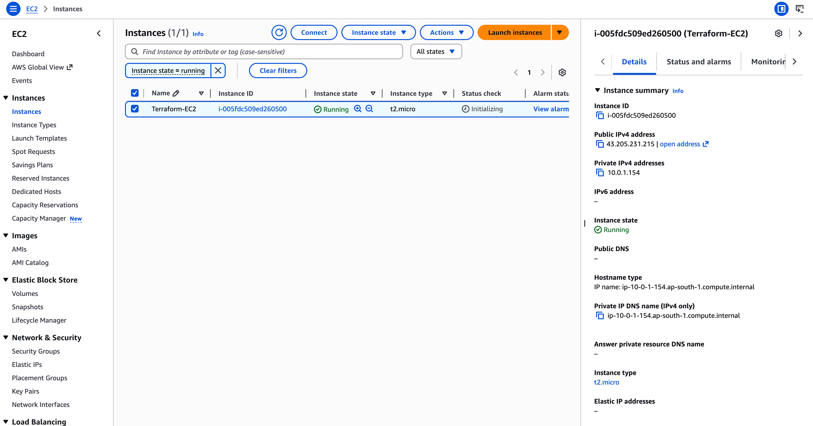
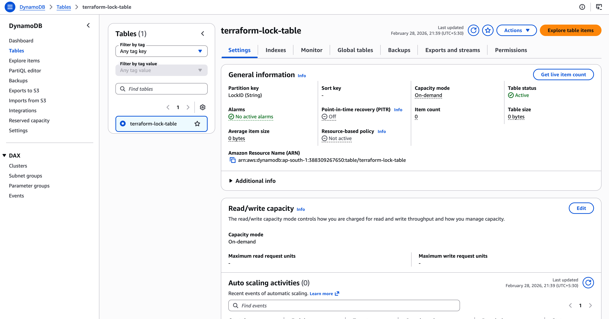

# DevOps Assignment - Production Infrastructure


This project implements a professional, secure, and production-ready DevOps workflow for deploying a FastAPI backend and Next.js frontend on AWS using Terraform.

## Architecture Overview

The infrastructure is designed following AWS best practices, emphasizing security, scalability, and reliability.

### Flow Diagram
```text
Terraform CLI
       ↓
Remote State (S3 Bucket) ← Versioning Enabled
       ↓
State Locking (DynamoDB) ← Prevents Corruption
       ↓
Infrastructure (VPC, EC2, IAM, SG)
```

### Key Components
- **Remote Backend (S3)**: State files are stored in a globally unique S3 bucket (`terraform-state-nandhushree-a`).
- **State Locking (DynamoDB)**: Prevents concurrent modifications to the infrastructure, ensuring state consistency.
- **Versioning**: Enabled on the S3 bucket to allow recovery from accidental state corruption or deletion.
- **Modular Infrastructure**: Clean separation of concerns using Terraform modules for VPC, EC2, IAM, and Security Groups.
- **Security**: Custom VPC with public subnets, internet gateway, and strictly defined security group rules.

## Project Structure

```text
.
├── backend/               # FastAPI backend application
├── frontend/              # Next.js frontend application
├── docs/                  # Documentation and architecture artifacts
│   └── screenshots/       # Deployment and infrastructure proof
└── terraform/             # Infrastructure as Code
    └── environments/
        └── dev/           # Development environment
            ├── main.tf    # Root configuration
            ├── backend.tf # Remote backend definition
            ├── providers.tf # Provider constraints
            └── terraform.tfvars # Environment variables
        ├── modules/   # Reusable infrastructure modules
            │   ├── vpc/   # Networking resources
            │   ├── ec2/   # Compute resources
            │   ├── iam/   # Identity and Access Management
            │   └── security-groups/ # Firewall rules
```

## Infrastructure Configuration

### Backend Setup
The backend is configured in `backend.tf`:
```hcl
terraform {
  backend "s3" {
    bucket         = "terraform-state-nandhushree-a"
    key            = "dev/terraform.tfstate"
    region         = "ap-south-1"
    dynamodb_table = "terraform-lock-table"
    encrypt        = true
  }
}
```

### Security Considerations
- **No Hardcoded Credentials**: AWS CLI is used for authentication via local profiles/environment variables.
- **State Protection**: `.tfstate` files are never committed to version control (managed via `.gitignore`).
- **Encryption**: Remote state is encrypted at rest in S3.
- **Least Privilege**: IAM roles are used to grant only necessary permissions to the EC2 instance.

## Deployment & Lifecycle

### Prerequisites
- Terraform >= 1.5.0
- AWS CLI configured with appropriate permissions
- AWS account with access to S3 and DynamoDB for backend

### 1. Initialize
Sets up the remote backend and downloads providers.
```bash
cd terraform/environments/dev
terraform init
```

### 2. Plan & Apply
Review and deploy the infrastructure.
```bash
terraform plan

```

### 3. Destroy
Clean up all resources to avoid unnecessary charges.
```bash
terraform destroy -auto-approve
```

## Best Practices Applied
- **Provider Constraints**: Fixed versions for AWS provider to ensure consistent deployments.
- **Resource Tagging**: Consistent tagging (`Environment`, `ManagedBy`, `Name`) for resource management.
- **Validation**: Automated `terraform fmt` and `terraform validate` checks.
- **Module Refactoring**: Encapsulated resource logic for reusability.

## Screenshots
*(Screenshots are located in `docs/screenshots/` and embedded below for quick review.)*

### EC2 Instance Running


### S3 Bucket with State File


### DynamoDB Lock Table


### Terraform Apply Output


### Terraform Destroy Output


## CI/CD
- GitHub Actions workflow validates Terraform on every push/PR:
  - Format check: `terraform fmt -check -recursive`
  - Initialization without backend: `terraform init -backend=false`
  - Validation: `terraform validate`
- Workflow file: `.github/workflows/terraform-ci.yml`
